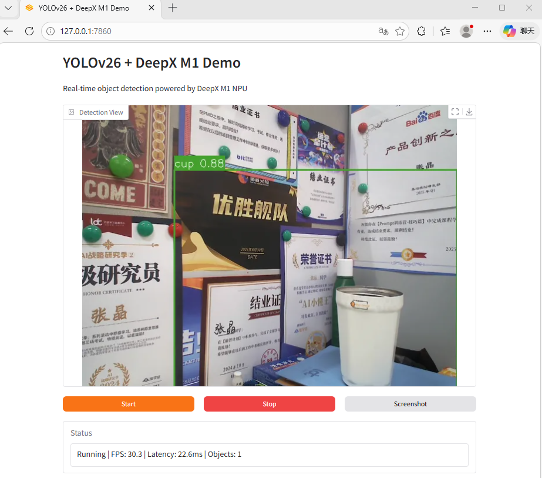

<div align="center">

# DeepXClaw

### Zero Lines of Code. Plug in Hardware. AI Does the Rest.

<br>

[](LICENSE)
[](https://www.python.org/)
[](https://github.com/AIwork4me/DeepXClaw/stargazers)


<br>

**English** | [中文](README_CN.md)

<br>



<br>

<em>This entire application — every line of code, every config, every pipeline decision — was built by <a href="https://github.com/AIwork4me">OpenClaw</a>, an AI Agent. The human just plugged in the hardware.</em>

</div>

<br>

## 🤯 What Just Happened?

A user plugged a [DeepX M1 NPU](https://www.deepx.ai/) into their PC. That's it. That's all they did.

**[OpenClaw](https://github.com/AIwork4me)** — an AI Agent — took over and autonomously:

| Step | What OpenClaw Did | Human Effort |
|:-----|:-------------------|:-------------|
| 1 | Installed DeepX NPU drivers and runtime SDK | None |
| 2 | Updated NPU firmware to latest version | None |
| 3 | Selected YOLOv26n as the optimal model for the hardware | None |
| 4 | Compiled the model to `.dxnn` format for NPU | None |
| 5 | Wrote the entire inference pipeline (camera, preprocessing, NPU inference, NMS, visualization) | None |
| 6 | Built a Gradio WebUI with real-time streaming | None |
| 7 | Debugged, tested, and shipped the application | None |

**Result**: A production-ready, 30 FPS real-time object detection app. Zero lines of human-written code.

## ✨ Why This Matters

Most AI hardware demos require days of manual setup: reading SDK docs, wrestling with drivers, writing boilerplate inference code, debugging threading issues, building a UI...

**OpenClaw eliminates all of that.** It is an end-to-end AI Agent that bridges the gap between "I have a chip" and "I have a working product."

```
 What you do:                    What OpenClaw does:
 ┌─────────────────┐             ┌─────────────────────────────────────┐
 │                 │             │  Install drivers                    │
 │  Plug in the    │             │  Update firmware                    │
 │  DeepX M1 NPU   │────────>   │  Select & compile model             │
 │                 │             │  Write application code             │
 │  (That's it.)   │             │  Build WebUI                        │
 │                 │             │  Test & ship                        │
 └─────────────────┘             └─────────────────────────────────────┘
```

> **This repo is the proof.** Every `.py` file you see was generated by OpenClaw. The human contributed exactly zero lines of application code.

## 📊 What OpenClaw Built

A complete real-time object detection system:

| Metric | Value |
|:-------|------:|
| NPU inference latency | **~25 ms** |
| End-to-end latency | **~35 ms** |
| Throughput | **~30 FPS** |
| Detected classes | 80 (COCO) |
| Power consumption | 15W TDP |
| Human code written | **0 lines** |

## 🚀 Try It Yourself

<details open>
<summary><b>Prerequisites</b></summary>

| You Provide | OpenClaw Handles |
|:------------|:-----------------|
| Windows 10/11 PC | Driver installation |
| DeepX M1 NPU (PCIe) | Firmware update |
| USB Webcam | Everything else |

</details>

<details open>
<summary><b>Run</b></summary>

```bash
git clone https://github.com/AIwork4me/DeepXClaw.git
cd DeepXClaw

pip install uv
uv sync

cp .deepxclaw.json.example .deepxclaw.json
# Edit .deepxclaw.json — set dxrt_bin and model_path

uv run deepxclaw
```

Open **http://localhost:7860** → click **Start** → real-time detection is running.

</details>

<details>
<summary><b>Configuration (.deepxclaw.json)</b></summary>

```json
{
  "dxrt_bin": "C:/path/to/dx_rt_windows/m1/v3.2.0/dx_rt/bin",
  "model_path": "models/yolo26n-1.dxnn",
  "sdk_repo": "C:/path/to/dx_rt_windows",
  "fw_repo": "C:/path/to/dx_fw",
  "models_cdn": "https://example.com/models"
}
```

| Field | Description |
|:------|:------------|
| `dxrt_bin` | Path to DeepX Runtime binaries |
| `model_path` | Path to compiled `.dxnn` model file |
| `sdk_repo` | DeepX SDK repository root |
| `fw_repo` | DeepX firmware repository root |
| `models_cdn` | CDN URL for pre-compiled models |

</details>

## 🏗️ Architecture (Designed by OpenClaw)

```
┌──────────┐    ┌──────────────┐    ┌──────────────┐    ┌──────────────┐    ┌──────────┐
│ USB      │    │ Threaded     │    │ DeepX M1     │    │ Per-class    │    │ Gradio   │
│ Webcam   │───>│ Capture      │───>│ NPU          │───>│ NMS          │───>│ WebUI    │
│          │    │ (camera.py)  │    │ (detector.py)│    │ (postproc.py)│    │ (app.py) │
└──────────┘    └──────────────┘    └──────────────┘    └──────────────┘    └──────────┘
  720p BGR       Queue(max=2)        640×640 uint8       IoU 0.45           Timer 100ms
                 drop-old-frames     [1,300,6] output    conf ≥ 0.25        poll & render
```

OpenClaw chose a multi-threaded architecture: camera capture in a daemon thread with frame-drop queue, NPU inference in a worker thread, and Gradio polling at 100ms intervals. This design maximizes throughput while keeping the UI responsive — a decision the agent made autonomously based on the hardware constraints.

<details>
<summary><b>📁 Project Structure</b> (all generated by OpenClaw)</summary>

```
DeepXClaw/
├── src/deepxclaw/
│   ├── app.py               # Gradio WebUI + detection worker thread
│   ├── camera.py            # Threaded USB webcam capture (OpenCV)
│   ├── detector.py          # DeepX M1 NPU inference (dx_engine)
│   ├── labels.py            # COCO 80-class labels + color palette
│   └── postprocess.py       # YOLOv26n output decode + NMS
├── models/                  # NPU models (.dxnn)
├── pyproject.toml           # Dependencies & CLI entry point
└── README.md
```

</details>

## 🔩 Hardware: DeepX M1 NPU

| Spec | Detail |
|:-----|:-------|
| Cores | 3 NPU cores |
| Memory | LPDDR5 3.92 GiB |
| Interface | PCIe Gen3 x4 |
| Power | 15W TDP |
| Model format | `.dxnn` (compiled from ONNX) |

## 🤝 Contributing

Contributions are welcome! Feel free to open issues or submit pull requests.

## 📜 License

[MIT License](LICENSE)

## 🙏 Acknowledgments

- [DeepX](https://www.deepx.ai/) — M1 NPU hardware & runtime SDK
- [Ultralytics](https://github.com/ultralytics/ultralytics) — YOLOv26 architecture
- [Gradio](https://gradio.app/) — WebUI framework

---

<div align="center">

**Built entirely by [OpenClaw](https://github.com/AIwork4me)** — the AI Agent that turns hardware into products.

*Plug in a chip. Get a working app. No code required.*

If this changes how you think about AI hardware development, give it a ⭐

</div>
